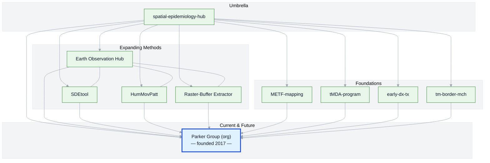

# Spatial Epidemiology Hub — Daniel M. Parker

This is my personal umbrella repository tying together projects, tools, and collaborations in GIS, spatial epidemiology, and public health. It is both a map of my career so far and a pointer to where my current and future work is headed. 

Most of my active research is now organized under the [**Parker Group organization**](https://github.com/parker-group), where we develop and share open spatial analysis tools and datasets. For a complete picture of our group’s work, see the [**Public Overview**](https://github.com/parker-group/public-overview).

**Jump to:** [Project Constellation](#constellation) · [Timeline](#timeline)

*Two complementary views: the Project Constellation shows how projects connect; the Timeline shows when they happened and how the methods evolved.*

---

## 🌍 Career Arc & Project Constellation

### 1. **Foundations** — Field epidemiology & GIS
Early work combining field research, geography (especially geographic reconnaissance), anthropology (ethnography and participant observation), and spatial analyses to understand health and disease in complex settings.

### 2. **Expanding Methods** — Earth Observation, Activity Space & Movement Analysis, and Spatial Modeling
Incorporating **Earth Observation**, **human movement studies**, **spatiotemporal analysis**, and tool development to answer new public health questions.

- [SDEtool](https://github.com/parker-group/SDEtool) — Our in-house R package for generating standard deviational ellipses.  
- [earth-observation-hub](https://github.com/DMParker1/earth-observation-hub) — Remote sensing methods applied to health and the environment.  
- [HumMovPatt](https://github.com/SaiTheinThanTun/HumMovPatt) — Human movement & exposure buffer size selection (DOI: [10.12688/wellcomeopenres.16784.2](https://doi.org/10.12688/wellcomeopenres.16784.2)).  
- **Raster-Buffer Extractor** — Helper functions to extract **time-series** environmental values from **raster stacks** within **user-defined buffers** around GPS points ([helper functions](https://github.com/CatalinaMedina/aedes-serology/tree/main/helper-functions), DOI: [10.1016/j.actatropica.2023.106829](https://doi.org/10.1016/j.actatropica.2023.106829)).

### 3. **Interdisciplinary Collaborations**
Working at the intersection of epidemiology, vector-borne disease control, climate, and health systems — often in challenging borderland and displacement contexts.

- [METF-mapping](https://github.com/DMParker1/METF-mapping) — Mapping and community engagement groundwork for malaria post placement.  
- [tMDA-program](https://github.com/DMParker1/tmda-program) — Targeted mass drug administration trials and modeling.  
- [early-dx-tx](https://github.com/DMParker1/early-dx-tx) — Early access to malaria diagnosis and treatment.  
- [tm-border-mch](https://github.com/DMParker1/tm-border-mch) — Maternal and child health research on the Thailand–Myanmar border.

### 4. **Current & Future Directions** — Parker Group
Most of my active and upcoming work happens within the **[Parker Group](https://github.com/parker-group)**, where we build open tools and curate datasets.  
For a complete, living catalog see the **[Public Overview](https://github.com/parker-group/public-overview)**.

---

## 🗺 Visual: Project Constellation

*Solid lines show the current structure. The timeline below captures sequence and method usage. The highlighted node marks the group I founded in 2017.*

---

## 📜 Career timeline (clickable)

<b>Show timeline</b>

- **1980–2009 — Early years:** I have loved maps since childhood → growing interest in GIS & disease mapping as an undergrad. student *(University of Washington, Seattle)*.  
- **2009–2014 — Penn State:** Spatial methods with [Stephen Matthews](https://sociology.la.psu.edu/people/stephen-a-matthews/); dissertation on malaria & demography along the Thailand–Myanmar border.  
- **Pre-METF — Early Dx/TX:** Long-running SMRU strategy; evidence base for later work → repo: [early-dx-tx](https://github.com/DMParker1/early-dx-tx).  
- **2013–2017 — tMDA trials:** MDA for *P. falciparum*; informed METF → repo: [tmda-program](https://github.com/DMParker1/tmda-program).  
- **2013–2017 — METF-mapping (postdoc at SMRU/MORU):** Built GIS for posts, logistics, analyses → repo: [METF-mapping](https://github.com/DMParker1/METF-mapping).  
- **2015–2017 — MCH analyses:** SMRU MCH predates METF; your role after METF start; leveraged METF GIS → repo: [tm-border-mch](https://github.com/DMParker1/tm-border-mch).  
- **2016+ — EO collaborations:** LOWMRU / Paul Newton; EO used in METF & MCH → hub: [earth-observation-hub](https://github.com/DMParker1/earth-observation-hub).  
- **2018+ — Methods focus:** [SDEtool](https://github.com/parker-group/SDEtool) · [HumMovPatt](https://github.com/SaiTheinThanTun/HumMovPatt) · [Raster-Buffer Extractor](https://github.com/CatalinaMedina/aedes-serology/tree/main/helper-functions).  
- **2017+ — UC Irvine:** Founded [Parker Group](https://github.com/parker-group) — open methods & datasets.

<!--
## 🧪 Methods ↔ Projects matrix (present links)

| Methods → Projects | METF | MCH | tMDA | EDT |
|---|:--:|:--:|:--:|:--:|
| **Earth Observation (EO)** | ✔️ | ✔️ |  |  |
| **SDEtool (SDE)** |  | ✔️ |  |  |
| **HumMovPatt** |  |  |  |  |
| **Raster-Buffer Extractor** |  |  |  |  |

> “EDT” = early-dx-tx.
-->

---
## 🔗 Related Repositories

- **Parker Group** — [Organization homepage](https://github.com/parker-group) | [Public Overview](https://github.com/parker-group/public-overview)  
- **Tools & Methods**  
  - [SDEtool](https://github.com/parker-group/SDEtool) — Standard Deviational Ellipse generation in R.  
  - [earth-observation-hub](https://github.com/DMParker1/earth-observation-hub) — EO and remote sensing workflows for health research.  
  - [HumMovPatt](https://github.com/SaiTheinThanTun/HumMovPatt) — Code and analysis for human movement & exposure buffer size selection (DOI: [10.12688/wellcomeopenres.16784.2](https://doi.org/10.12688/wellcomeopenres.16784.2)).  
  - **Raster-Buffer Extractor** — Scripts for extracting time-series environmental data from raster stacks within user-defined buffers around GPS coordinates; developed for an Aedes exposure study but applicable to EO data in general ([helper functions](https://github.com/CatalinaMedina/aedes-serology/tree/main/helper-functions), DOI: [10.1016/j.actatropica.2023.106829](https://doi.org/10.1016/j.actatropica.2023.106829)).  
- **Ongoing Themes & Representative Projects**  
  *(These links highlight key areas that have shaped my work and continue to influence my research. I add new examples over time; for the full scope of current activities, see the [Parker Group Public Overview](https://github.com/parker-group/public-overview).)*  
  - [METF-mapping](https://github.com/DMParker1/METF-mapping) — Mapping malaria post placement & community engagement.  
  - [tMDA-program](https://github.com/DMParker1/tmda-program) — Targeted mass drug administration trials & modeling.  
  - [early-dx-tx](https://github.com/DMParker1/early-dx-tx) — Early access to malaria diagnosis & treatment.  
  - [tm-border-mch](https://github.com/DMParker1/tm-border-mch) — Maternal and child health on the Thailand–Myanmar border.

---

© Daniel M. Parker — See individual repositories for license details.
