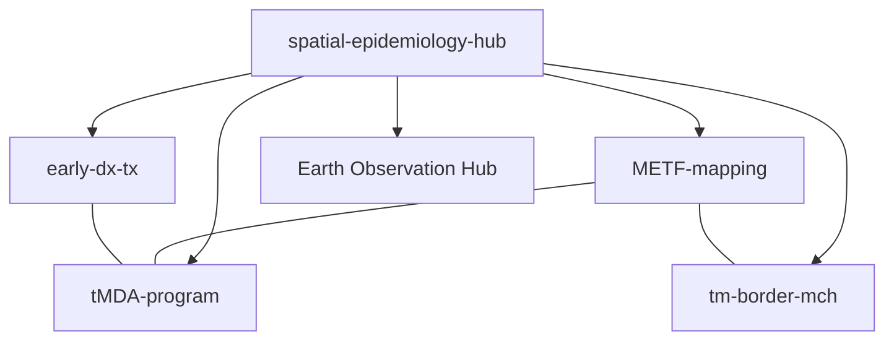

# GIS & Spatial Epidemiology Hub

This repository is a **minimal umbrella** that maps how my projects connect through GIS and spatial analysis. Earth observation is one component within this broader geospatial toolkit.

---

## Constellation: Project Map

---

## Related Repositories

- [spatial-epidemiology-hub](https://github.com/DMParker1/spatial-epidemiology-hub) — Minimal umbrella repo showing how my projects connect through GIS and spatial epidemiology.  
- [METF-mapping](https://github.com/DMParker1/METF-mapping) — Mapping and community engagement groundwork for malaria post placement and METF operations.  
- [tMDA-program](https://github.com/DMParker1/tmda-program) — Targeted mass drug administration trials and modeling in Southeast Asia.  
- [early-dx-tx](https://github.com/DMParker1/early-dx-tx) — Early access to malaria diagnosis and treatment.  
- [tm-border-mch](https://github.com/DMParker1/tm-border-mch) — Maternal and child health research on the Thailand–Myanmar border.  
- [earth-observation-hub](https://github.com/DMParker1/earth-observation-hub) — Remote sensing and Earth observation methods applied to public health.  
- [SDEtool](https://github.com/parker-group/SDEtool) — In-house standard deviational ellipse generation tool for spatial epidemiology and movement analysis; available for related work but not used in these specific projects.
---
