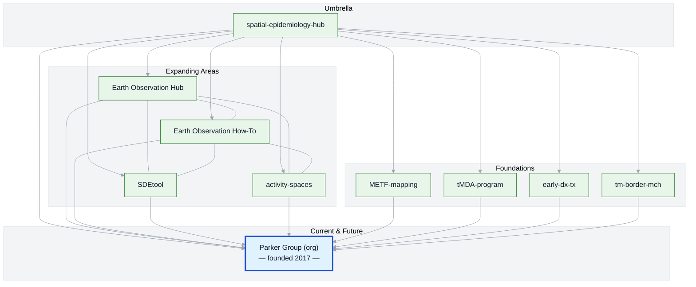

# Spatial Epidemiology Hub — Daniel M. Parker

This is my personal umbrella repository — a map of my career arc and a guide to where my work is headed. It highlights the projects, methods, and contexts that have shaped my research.  

Much of my current team-based research now happens within the [**Parker Group organization**](https://github.com/parker-group), which I founded in 2017. That hub catalogs and maintains our group’s shared tools and datasets. This repo, by contrast, centers on my own trajectory and motivations.  

---

## 🌍 Career Arc

### 1. **Foundations** — Field epidemiology & GIS
Early work combining field research, geography (especially geographic reconnaissance), anthropology (ethnography and participant observation), and spatial analyses to understand health and disease in complex settings.

### 2. **Expanding Methods** — Earth Observation, Movement Analysis, Spatial Modeling
Incorporating **Earth Observation**, **human movement studies**, and **spatiotemporal methods** to address new public health questions.  

- [activity-spaces](https://github.com/DMParker1/activity-spaces) — Multi-place exposure and its relevance for health.  
- [Earth Observation How-To](https://github.com/parker-group/earth-observation-howto) — Linking Earth observation data to places and times.  
- [SDEtool](https://github.com/parker-group/SDEtool) — R tool for standard deviational ellipses.  

### 3. **Interdisciplinary Collaborations**
Working across epidemiology, vector-borne disease control, climate, and health systems — often in borderland and displacement contexts.  

- [METF-mapping](https://github.com/DMParker1/METF-mapping) — GIS and community engagement for malaria post placement.  
- [tMDA-program](https://github.com/DMParker1/tmda-program) — Targeted mass drug administration trials and modeling.  
- [early-dx-tx](https://github.com/DMParker1/early-dx-tx) — Early access to malaria diagnosis and treatment.  
- [tm-border-mch](https://github.com/DMParker1/tm-border-mch) — Maternal and child health research on the Thailand–Myanmar border.  

### 4. **Current & Future Directions**
Today, most of my active and upcoming work continues through the [**Parker Group**](https://github.com/parker-group), where we build open methods and datasets. See the [**Public Overview**](https://github.com/parker-group/public-overview) for a complete, living catalog.  

---

## 🗺 Visual: Project Constellation

*Solid lines show the current structure. The timeline below captures sequence and method usage. The highlighted node marks the group I founded in 2017.*

---

## 📜 Career timeline (clickable)

<b>Show timeline</b>

- **1980–2009 — Early years:** I have loved maps since childhood → growing interest in GIS & disease mapping as an undergrad. student *(University of Washington, Seattle)*.  
- **2009–2014 — Penn State:** Spatial methods with [Stephen Matthews](https://sociology.la.psu.edu/people/stephen-a-matthews/); dissertation on malaria & demography along the Thailand–Myanmar border. My interest in tropical diseases began at UW Seattle, but was cemented at Penn State w/ the ICEMR project and [Liwang Cui's](https://health.usf.edu/medicine/internalmedicine/infectious/faculty/liwangcui) mentorship. 
- **2013–2017 — tMDA trials:** MDA (mass drug admin.) for *P. falciparum*; informed METF → repo: [tmda-program](https://github.com/DMParker1/tmda-program).  
- **2013–2017 — Malaria Elimination Task Force (METF)-mapping (postdoc at SMRU/MORU):** Built GIS for malaria posts, logistics, analyses → repo: [METF-mapping](https://github.com/DMParker1/METF-mapping).  
- **2015–2017 — Maternal/Child Health (MCH) analyses:** SMRU MCH predates METF; I had (and have) several collaborations w/ [Roes McGready](https://www.ndm.ox.ac.uk/team/rose-mcgready); leveraged METF GIS → repo: [tm-border-mch](https://github.com/DMParker1/tm-border-mch).  
- **2016+     — EO collaborations:** LOWMRU / [Paul Newton](https://www.ndm.ox.ac.uk/team/paul-newton); EO used in METF & MCH → hub: [earth-observation-hub](https://github.com/DMParker1/earth-observation-hub).  
- **2017+     — Methods focus:** [SDEtool](https://github.com/parker-group/SDEtool) · [HumMovPatt](https://github.com/SaiTheinThanTun/HumMovPatt) · [earth-observation-howto](https://github.com/parker-group/earth-observation-howto).  
- **2017+     — UC Irvine:** Founded [Parker Group](https://github.com/parker-group) — open methods & datasets.

<!--
## 🧪 Methods ↔ Projects matrix (present links)

| Methods → Projects | METF | MCH | tMDA | EDT |
|---|:--:|:--:|:--:|:--:|
| **Earth Observation (EO)** | ✔️ | ✔️ |  |  |
| **SDEtool (SDE)** |  | ✔️ |  |  |
| **HumMovPatt** |  |  |  |  |
| **Raster-Buffer Extractor** |  |  |  |  |

> “EDT” = early-dx-tx.
-->

---

## 🔗 Related Repositories

A collected index of the repositories linked to my career arc.  

### 🧰 Methods & Tools
- [earth-observation-howto](https://github.com/parker-group/earth-observation-howto)  
- [SDEtool](https://github.com/parker-group/SDEtool)  

### 🔎 Study Areas & Narratives
- [earth-observation-hub](https://github.com/DMParker1/earth-observation-hub) — How EO became central to my research.  
- [activity-spaces](https://github.com/DMParker1/activity-spaces) — Multi-place exposure and health relevance.  
- [METF-mapping](https://github.com/DMParker1/METF-mapping) — Mapping malaria posts & community engagement.  
- [tMDA-program](https://github.com/DMParker1/tmda-program) — Targeted MDA trials & modeling.  
- [early-dx-tx](https://github.com/DMParker1/early-dx-tx) — Early access to malaria diagnosis/treatment.  
- [tm-border-mch](https://github.com/DMParker1/tm-border-mch) — Maternal & child health on the Thai–Myanmar border.  

### 🌐 Current & Future Directions
Most ongoing work is now organized under the [**Parker Group**](https://github.com/parker-group).  

---

© Daniel M. Parker — See individual repositories for license details.

