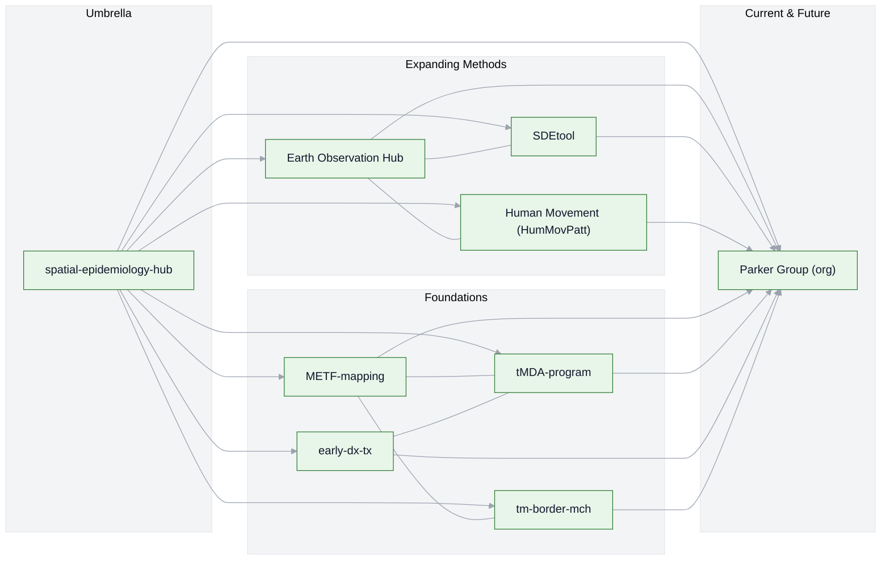

# Spatial Epidemiology Hub — Daniel M. Parker

This is my personal umbrella repository tying together projects, tools, and collaborations in **GIS** and **spatial epidemiology**.  
It’s both a **map of my career so far** and a **pointer to where my current and future work is headed**.

Most of my active research is now organized under the [**Parker Group organization**](https://github.com/parker-group), where we develop and share open spatial analysis tools and datasets.  
For a complete picture of our group’s work, see the [**Public Overview**](https://github.com/parker-group/public-overview).

---

## 🌍 Career Arc & Project Constellation

### 1. **Foundations** — Field epidemiology & GIS
Early work combining field research, anthropology, and spatial analysis to understand health and disease in complex settings.

### 2. **Expanding Methods** — Remote sensing, spatial modeling & human movement
Incorporating **Earth observation**, **spatiotemporal analysis**, **human movement research**, and tool development to answer new public health questions.

- [SDEtool](https://github.com/parker-group/SDEtool) — Our in-house R package for generating standard deviational ellipses, used in spatial epidemiology and movement analysis.  
- [earth-observation-hub](https://github.com/DMParker1/earth-observation-hub) — Remote sensing methods applied to health and environment.  
- [HumMovPatt](https://github.com/SaiTheinThanTun/HumMovPatt) — Code and analysis for human movement & exposure buffer size selection (Wellcome Open Research study).

### 3. **Interdisciplinary Collaborations**
Working at the intersection of epidemiology, vector-borne disease control, climate, and health systems — often in challenging borderland and displacement contexts.

- [METF-mapping](https://github.com/DMParker1/METF-mapping) — Mapping and community engagement groundwork for malaria post placement.  
- [tMDA-program](https://github.com/DMParker1/tmda-program) — Targeted mass drug administration trials and modeling.  
- [early-dx-tx](https://github.com/DMParker1/early-dx-tx) — Early access to malaria diagnosis and treatment.  
- [tm-border-mch](https://github.com/DMParker1/tm-border-mch) — Maternal and child health research on the Thailand–Myanmar border.

### 4. **Current & Future Directions** — Parker Group
Most of my active and upcoming work happens within the **[Parker Group](https://github.com/parker-group)**, where we build open tools and curate datasets.  
For a complete, living catalog see the **[Public Overview](https://github.com/parker-group/public-overview)**.

---

## 🗺 Visual: Project Constellation

---

## 🔗 Related Repositories

- **Parker Group** — [Organization homepage](https://github.com/parker-group) | [Public Overview](https://github.com/parker-group/public-overview)  
- **Tools & Methods**  
  - [SDEtool](https://github.com/parker-group/SDEtool) — Standard Deviational Ellipse generation in R.  
  - [earth-observation-hub](https://github.com/DMParker1/earth-observation-hub) — EO and remote sensing workflows for health research.  
- **Ongoing Themes & Representative Projects**  
  *(These links highlight key areas that have shaped my work and continue to influence my research. I add new examples over time; for the full scope of current activities, see the [Parker Group Public Overview](https://github.com/parker-group/public-overview).)*  
  - [METF-mapping](https://github.com/DMParker1/METF-mapping) — Mapping malaria post placement & community engagement.  
  - [tMDA-program](https://github.com/DMParker1/tmda-program) — Targeted mass drug administration trials & modeling.  
  - [early-dx-tx](https://github.com/DMParker1/early-dx-tx) — Early access to malaria diagnosis & treatment.  
  - [tm-border-mch](https://github.com/DMParker1/tm-border-mch) — Maternal & child health on the Thailand–Myanmar border.

---

© Daniel M. Parker — See individual repositories for license details.
