# Spatial Epidemiology Hub — Daniel M. Parker

This is my personal umbrella repository tying together projects, tools, and collaborations in GIS, spatial epidemiology, and public health. It is both a map of my career so far and a pointer to where my current and future work is headed. 

Most of my active research is now organized under the [**Parker Group organization**](https://github.com/parker-group), where we develop and share open spatial analysis tools and datasets. For a complete picture of our group’s work, see the [**Public Overview**](https://github.com/parker-group/public-overview).

**Jump to:** [Project Constellation](#constellation) · [Timeline](#timeline)

*Two complementary views: the Project Constellation shows how projects connect; the Timeline shows when they happened and how the methods evolved.*

---

## 🌍 Career Arc & Project Constellation

### 1. **Foundations** — Field epidemiology & GIS
Early work combining field research, geography (especially geographic reconnaissance), anthropology (ethnography and participant observation), and spatial analyses to understand health and disease in complex settings.

### 2. **Expanding Methods** — Earth Observation, Activity Space & Movement Analysis, and Spatial Modeling
Incorporating **Earth Observation**, **human movement studies**, **spatiotemporal analysis**, and tool development to answer new public health questions.

**Methods & Tools**
- [earth-observation-howto](https://github.com/parker-group/earth-observation-howto) — Practical guides for weather station and satellite data, zonal stats, raster wrangling.  
- [activity-spaces](https://github.com/DMParker1/activity-spaces) — Sometimes we spend time away from home and that is likely important for our health.  
- [SDEtool](https://github.com/parker-group/SDEtool) — R package for standard deviational ellipses.  

**Narrative & Background**
- [earth-observation-hub](https://github.com/DMParker1/earth-observation-hub) — Storytelling hub: how I got into Earth Observation work, with a curated list of relevant papers and case studies.  

### 3. **Interdisciplinary Collaborations**
Working at the intersection of epidemiology, vector-borne disease control, climate, and health systems — often in challenging borderland and displacement contexts.

- [METF-mapping](https://github.com/DMParker1/METF-mapping) — Mapping and community engagement groundwork for malaria post placement.  
- [tMDA-program](https://github.com/DMParker1/tmda-program) — Targeted mass drug administration trials and modeling.  
- [early-dx-tx](https://github.com/DMParker1/early-dx-tx) — Early access to malaria diagnosis and treatment.  
- [tm-border-mch](https://github.com/DMParker1/tm-border-mch) — Maternal and child health research on the Thailand–Myanmar border.

### 4. **Current & Future Directions** — Parker Group
Most of my active and upcoming work happens within the **[Parker Group](https://github.com/parker-group)**, where we build open tools and curate datasets.  
For a complete, living catalog see the **[Public Overview](https://github.com/parker-group/public-overview)**.

---

## 🗺 Visual: Project Constellation

```mermaid
%%{init: {"theme":"base","themeVariables": {
  "background":"#FAFAFA","clusterBkg":"#F3F4F6","clusterBorder":"#E5E7EB",
  "primaryColor":"#E8F5E9","primaryBorderColor":"#2E7D32",
  "primaryTextColor":"#0F172A","lineColor":"#9CA3AF"
}, "flowchart":{"rankSpacing":45,"nodeSpacing":30}}}%%
flowchart TB
  subgraph A[Foundations]
    direction LR
    EDT["early-dx-tx"]
    tMDA["tMDA-program"]
    MCH["tm-border-mch"]
    METF["METF-mapping"]
  end
  subgraph B[Expanding Areas]
    direction LR
    EO["Earth Observation Hub"]
    HOWTO["Earth Observation How-To"]
    SDE["SDEtool"]
    AS["activity-spaces"]
  end
  subgraph C[Umbrella]
    GIS["spatial-epidemiology-hub"]
  end
  subgraph D[Current & Future]
    PG["Parker Group (org)\n— founded 2017 —"]:::pg
  end

  %% Umbrella links
  GIS --> EDT
  GIS --> tMDA
  GIS --> MCH
  GIS --> METF
  GIS --> EO
  GIS --> HOWTO
  GIS --> SDE
  GIS --> AS
  GIS --> PG

  %% Method interplay
  EO --- HOWTO
  EO --- SDE
  EO --- AS
  HOWTO --- SDE
  HOWTO --- AS

  %% Convergence to Parker Group
  EO --> PG
  HOWTO --> PG
  SDE --> PG
  AS --> PG
  METF --> PG
  tMDA --> PG
  EDT --> PG
  MCH --> PG

  %% Clickable links
  click GIS "https://github.com/DMParker1/spatial-epidemiology-hub" "spatial-epidemiology-hub"
  click EDT "https://github.com/DMParker1/early-dx-tx" "early-dx-tx repository"
  click tMDA "https://github.com/DMParker1/tmda-program" "tMDA-program repository"
  click MCH "https://github.com/DMParker1/tm-border-mch" "tm-border-mch repository"
  click METF "https://github.com/DMParker1/METF-mapping" "METF-mapping repository"
  click EO "https://github.com/DMParker1/earth-observation-hub" "Earth Observation Hub"
  click HOWTO "https://github.com/parker-group/earth-observation-howto" "EO How-To Guides"
  click SDE "https://github.com/parker-group/SDEtool" "SDEtool package"
  click AS "https://github.com/DMParker1/activity-spaces" "activity-spaces repository"
  click PG "https://github.com/parker-group" "Parker Group organization"

  %% Highlight Parker Group node
  classDef pg fill:#E0F2FE,stroke:#1D4ED8,stroke-width:3px;
```

*Solid lines show the current structure. The timeline below captures sequence and method usage. The highlighted node marks the group I founded in 2017.*

---

## 📜 Career timeline (clickable)

<b>Show timeline</b>

- **1980–2009 — Early years:** I have loved maps since childhood → growing interest in GIS & disease mapping as an undergrad. student *(University of Washington, Seattle)*.  
- **2009–2014 — Penn State:** Spatial methods with [Stephen Matthews](https://sociology.la.psu.edu/people/stephen-a-matthews/); dissertation on malaria & demography along the Thailand–Myanmar border.  
- **Pre-METF  — Early Dx/TX:** Long-running SMRU strategy; evidence base for later work → repo: [early-dx-tx](https://github.com/DMParker1/early-dx-tx).  
- **2013–2017 — tMDA trials:** MDA for *P. falciparum*; informed METF → repo: [tmda-program](https://github.com/DMParker1/tmda-program).  
- **2013–2017 — METF-mapping (postdoc at SMRU/MORU):** Built GIS for malaria posts, logistics, analyses → repo: [METF-mapping](https://github.com/DMParker1/METF-mapping).  
- **2015–2017 — MCH analyses:** SMRU MCH predates METF; your role after METF start; leveraged METF GIS → repo: [tm-border-mch](https://github.com/DMParker1/tm-border-mch).  
- **2016+     — EO collaborations:** LOWMRU / Paul Newton; EO used in METF & MCH → hub: [earth-observation-hub](https://github.com/DMParker1/earth-observation-hub).  
- **2017+     — Methods focus:** [SDEtool](https://github.com/parker-group/SDEtool) · [HumMovPatt](https://github.com/SaiTheinThanTun/HumMovPatt) · [earth-observation-howto](https://github.com/parker-group/earth-observation-howto).  
- **2017+     — UC Irvine:** Founded [Parker Group](https://github.com/parker-group) — open methods & datasets.

<!--
## 🧪 Methods ↔ Projects matrix (present links)

| Methods → Projects | METF | MCH | tMDA | EDT |
|---|:--:|:--:|:--:|:--:|
| **Earth Observation (EO)** | ✔️ | ✔️ |  |  |
| **SDEtool (SDE)** |  | ✔️ |  |  |
| **HumMovPatt** |  |  |  |  |
| **Raster-Buffer Extractor** |  |  |  |  |

> “EDT” = early-dx-tx.
-->

---
## 🔗 Related Repositories

This section collects the major repositories linked to my career arc.  
For the full scope of active projects and datasets, see the **[Parker Group Public Overview](https://github.com/parker-group/public-overview)**.

---

### 🧰 Methods & Tools
Reusable analysis frameworks and packages.

- [earth-observation-howto](https://github.com/parker-group/earth-observation-howto) — Practical guides for weather station and satellite data, zonal stats, raster wrangling.  
- [SDEtool](https://github.com/parker-group/SDEtool) — Standard Deviational Ellipse generation in R.  

---

### 🔎 Study Areas & Narratives
Hubs and projects that map out broader themes, blending fieldwork, methods, and background.

- [earth-observation-hub](https://github.com/DMParker1/earth-observation-hub) — Synthesis of how Earth Observation methods became central to my research, with curated papers and illustrative case studies.
- [activity-spaces](https://github.com/DMParker1/activity-spaces) — Understanding multi-place exposure (farm huts, GPS, mobile phone data) and its health relevance.  
- [METF-mapping](https://github.com/DMParker1/METF-mapping) — Mapping malaria post placement & community engagement.  
- [tMDA-program](https://github.com/DMParker1/tmda-program) — Targeted mass drug administration trials & modeling.  
- [early-dx-tx](https://github.com/DMParker1/early-dx-tx) — Early access to malaria diagnosis & treatment.  
- [tm-border-mch](https://github.com/DMParker1/tm-border-mch) — Maternal and child health on the Thailand–Myanmar border.  

---

### 🌐 Parker Group (Current & Future)
Most active work now resides in the [**Parker Group organization**](https://github.com/parker-group).  
- [Organization homepage](https://github.com/parker-group)  
- [Public Overview](https://github.com/parker-group/public-overview) — living catalog of tools, datasets, and collaborations.  

---

© Daniel M. Parker — See individual repositories for license details.
