# Spatial Epidemiology Hub — Daniel M. Parker

[](../../releases)

This is my personal umbrella repository tying together projects, tools, and collaborations in GIS, spatial epidemiology, and public health. It is both a **map of my career so far** and a **pointer to where my current and future work is headed**.

Most of my active research is now organized under the [**Parker Group organization**](https://github.com/parker-group), where we develop and share open spatial analysis tools and datasets. For a complete picture of our group’s work, see the [**Public Overview**](https://github.com/parker-group/public-overview).

---

## 🌍 Career Arc & Project Constellation

### 1. **Foundations** — Field epidemiology & GIS
Early work combining field research, geography (especially geographic reconnaissance) anthropology (ethnography and participant observation), and spatial analyses to understand health and disease in complex settings.

### 2. **Expanding Methods** — Earth observation, activity space and movement analysis, & spatial modeling
Incorporating **Earth observation**, **human movement studies**, **spatiotemporal analysis**, and tool development to answer new public health questions.

- [SDEtool](https://github.com/parker-group/SDEtool) — Our in-house R package for generating standard deviational ellipses.  
- [earth-observation-hub](https://github.com/DMParker1/earth-observation-hub) — Remote sensing methods applied to health and environment.  
- [HumMovPatt](https://github.com/SaiTheinThanTun/HumMovPatt) — Human movement & exposure buffer size selection (DOI: [10.12688/wellcomeopenres.16784.2](https://doi.org/10.12688/wellcomeopenres.16784.2)).  
- **Raster-Buffer Extractor** — Helper functions to extract **time-series** environmental values from **raster stacks** within **user-defined buffers** around GPS points ([helper functions](https://github.com/CatalinaMedina/aedes-serology/tree/main/helper-functions)).

### 3. **Interdisciplinary Collaborations**
Working at the intersection of epidemiology, vector-borne disease control, climate, and health systems — often in challenging borderland and displacement contexts.

- [METF-mapping](https://github.com/DMParker1/METF-mapping) — Mapping and community engagement groundwork for malaria post placement.  
- [tMDA-program](https://github.com/DMParker1/tmda-program) — Targeted mass drug administration trials and modeling.  
- [early-dx-tx](https://github.com/DMParker1/early-dx-tx) — Early access to malaria diagnosis and treatment.  
- [tm-border-mch](https://github.com/DMParker1/tm-border-mch) — Maternal and child health research on the Thailand–Myanmar border.

### 4. **Current & Future Directions** — Parker Group
Most of my active and upcoming work happens within the **[Parker Group](https://github.com/parker-group)**, where we build open tools and curate datasets.  
For a complete, living catalog see the **[Public Overview](https://github.com/parker-group/public-overview)**.

---

## 🗺 Visual: Project Constellation

```mermaid
%%{init: {"theme":"base","themeVariables":{
  "background":"#FAFAFA",
  "clusterBkg":"#F3F4F6",
  "clusterBorder":"#E5E7EB",
  "primaryColor":"#E8F5E9",
  "primaryBorderColor":"#2E7D32",
  "primaryTextColor":"#0F172A",
  "lineColor":"#9CA3AF"
}, "flowchart":{"rankSpacing":45,"nodeSpacing":30}}}%%
flowchart TB

  subgraph A[Foundations]
    direction LR
    EDT["early-dx-tx"]
    tMDA["tMDA-program"]
    MCH["tm-border-mch"]
    METF["METF-mapping"]
  end

  subgraph B[Expanding Methods]
    direction LR
    EO["Earth Observation Hub"]
    SDE["SDEtool"]
    HUM["HumMovPatt"]
    RBE["Raster-Buffer Extractor"]
  end

  subgraph C[Umbrella]
    GIS["spatial-epidemiology-hub"]
  end

  subgraph D[Current & Future]
    PG["Parker Group (org)"]
  end

  %% umbrella links (solid)
  GIS --> EDT
  GIS --> tMDA
  GIS --> MCH
  GIS --> METF
  GIS --> EO
  GIS --> SDE
  GIS --> HUM
  GIS --> RBE
  GIS --> PG

  %% method/theme crosslinks (solid)
  EO --- SDE
  EO --- HUM
  EO --- RBE
  tMDA --- METF
  EDT --- METF
  MCH --- METF

  %% convergence to Parker Group (solid)
  EO --> PG
  SDE --> PG
  HUM --> PG
  RBE --> PG
  METF --> PG
  tMDA --> PG
  EDT --> PG
  MCH --> PG

  %% historical/methodological influence (dashed with labels)
  EO -. EO data .-> METF
  EO -. EO data .-> MCH
  SDE -. SDE methods .-> MCH
  EDT -. Evidence base .-> tMDA
  tMDA -. MDA trial design .-> METF
  EDT -. Early Dx/TX model .-> METF
  MCH -. Records + context .-> METF

  %% style dashed influence edges (light blue)
  %% NOTE: link indexes are zero-based; with the links above, dashed edges are 23–29.
  linkStyle 23 stroke:#4DA3FF,stroke-width:2px,stroke-dasharray:5 5;
  linkStyle 24 stroke:#4DA3FF,stroke-width:2px,stroke-dasharray:5 5;
  linkStyle 25 stroke:#4DA3FF,stroke-width:2px,stroke-dasharray:5 5;
  linkStyle 26 stroke:#4DA3FF,stroke-width:2px,stroke-dasharray:5 5;
  linkStyle 27 stroke:#4DA3FF,stroke-width:2px,stroke-dasharray:5 5;
  linkStyle 28 stroke:#4DA3FF,stroke-width:2px,stroke-dasharray:5 5;
  linkStyle 29 stroke:#4DA3FF,stroke-width:2px,stroke-dasharray:5 5;
```



```mermaid
flowchart LR
  subgraph Legend
    S[Structural link (solid)] --> O[Current relationship]
    H[Historical/method link (dashed blue)] -.-> I[Past influence]
  end
  %% style the dashed legend edge (index 1 in this tiny diagram)
  linkStyle 1 stroke:#4DA3FF,stroke-width:2px,stroke-dasharray:5 5;
```

---

## 🔗 Related Repositories

- **Parker Group** — [Organization homepage](https://github.com/parker-group) | [Public Overview](https://github.com/parker-group/public-overview)  
- **Tools & Methods**  
  - [SDEtool](https://github.com/parker-group/SDEtool) — Standard Deviational Ellipse generation in R.  
  - [earth-observation-hub](https://github.com/DMParker1/earth-observation-hub) — EO and remote sensing workflows for health research.  
  - [HumMovPatt](https://github.com/SaiTheinThanTun/HumMovPatt) — Code and analysis for human movement & exposure buffer size selection (DOI: [10.12688/wellcomeopenres.16784.2](https://doi.org/10.12688/wellcomeopenres.16784.2)).  
  - **Raster-Buffer Extractor** — Scripts for extracting time-series environmental data from raster stacks within user-defined buffers around GPS coordinates; developed for an Aedes exposure study but applicable to EO data in general ([helper functions](https://github.com/CatalinaMedina/aedes-serology/tree/main/helper-functions), DOI: [10.1016/j.actatropica.2023.106829](https://doi.org/10.1016/j.actatropica.2023.106829)).  
- **Ongoing Themes & Representative Projects**  
  *(These links highlight key areas that have shaped my work and continue to influence my research. I add new examples over time; for the full scope of current activities, see the [Parker Group Public Overview](https://github.com/parker-group/public-overview).)*  
  - [METF-mapping](https://github.com/DMParker1/METF-mapping) — Mapping malaria post placement & community engagement.  
  - [tMDA-program](https://github.com/DMParker1/tmda-program) — Targeted mass drug administration trials & modeling.  
  - [early-dx-tx](https://github.com/DMParker1/early-dx-tx) — Early access to malaria diagnosis & treatment.  
  - [tm-border-mch](https://github.com/DMParker1/tm-border-mch) — Maternal and child health on the Thailand–Myanmar border.

---

<sub>© Daniel M. Parker — See individual repositories for license details.</sub>
